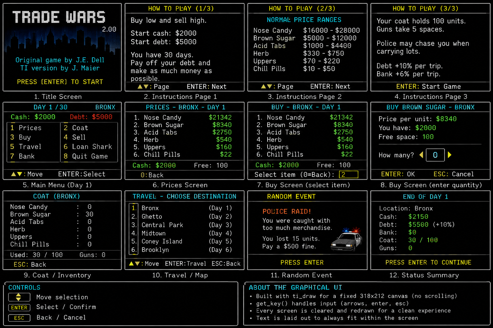

# Drug Wars for TI-Nspire CX II



A TI-Nspire CX II / CX II CAS port of the classic calculator game **Drug Wars**, with both text-shell and full-screen graphical Python implementations.

This repository also preserves the working Windows-first **VS Code -> Luna -> `.tns` -> TI-Nspire CX II Connect -> calculator** build workflow used to develop and test the port.

## Current implementations

### `src/drugwars_ti_nspire_cx2_graphical_v1.py`

The current graphical edition. It uses the TI-Nspire Python graphics/input APIs instead of the scrolling Python Shell UI.

Features include:

- full-screen `ti_draw` rendering
- buffered screen redraws
- arrow-key menu navigation
- Enter to select / confirm
- Esc to go back or quit
- graphical numeric entry for buy/sell/bank/loan amounts
- persistent day, location, cash, debt, inventory, and status displays
- six locations and six commodities
- random market events
- trenchcoat capacity upgrades
- bank and loan shark
- police chase/combat events
- damage, doctor, guns, and final scoring

### `src/drugwars_ti_nspire_cx2.py`

Text-shell TI-Nspire Python port. This was the first fuller port of the historical TI-BASIC game and is useful as a simpler reference implementation.

### `src/drugwars.py`

Small starter/smoke-test implementation used by the original Luna build workflow.

## Gameplay

The player begins in the **Bronx** with:

- `$2,000` cash
- `$5,000` debt
- `100` trenchcoat spaces
- `30` days

The core loop is simple: travel, watch prices, buy low, sell high, manage debt and cash, survive random events, and finish with the highest possible net worth.

Travel advances the day and generates a new market. In the historical rules used by this port:

- loan-shark debt grows by **10% per trip**
- money in the bank grows by **6% per trip**

The game also includes special price crashes/spikes, subway events, found inventory, coat upgrades, firearms, police pursuits, combat, medical treatment, and a final score based on net worth.

## Historical basis and attribution

This is an **unofficial reimplementation** inspired by the historical Drug Wars family of games, especially:

- **John E. Dell** — original Drug Wars game
- **Jonathan Maier / J.M.** — *J.M.'s Drugwar Simulation 2.00* for TI-82/83-era calculators (1994)

Historical TI-BASIC source used as a behavioral reference:

- https://gist.github.com/mattmanning/1002653

The Python versions in this repository are rewritten implementations rather than a claim of ownership over the historical game or its original source. The port also separates state that appears to collide in the archived TI-BASIC implementation (notably the reused `N` variable).

No affiliation with or endorsement by Texas Instruments, John E. Dell, Jonathan Maier, or the maintainers of historical archives is implied.

See [`REFERENCES.md`](REFERENCES.md) for source and tooling references.

## Build workflow

```text
VS Code `.py`
      |
      v
     Luna
      |
      v
    `.tns`
      |
      v
TI-Nspire CX II Connect
      |
      v
  calculator
```

### Requirements

- TI-Nspire CX II / CX II CAS
- Calculator OS **5.2 or later** for Luna Python conversion
- VS Code
- PowerShell
- either:
  - a Windows `luna.exe` placed in `tools\`, or
  - WSL, which can build Luna automatically with the included setup script
- TI-Nspire CX II Connect in a supported browser

### Luna setup with WSL

```powershell
powershell -ExecutionPolicy Bypass -File .\scripts\setup-luna-wsl.ps1
```

The setup script installs the required Linux build dependencies, clones/updates Luna, builds it, and copies the resulting binary to `tools\luna-linux`.

### Build the default starter

```powershell
.\scripts\build.ps1
```

Expected output:

```text
dist\DrugWars.tns
```

The current `build.ps1` default source is `src\drugwars.py`.

### Build the full text port

```powershell
.\scripts\build.ps1 `
  -Source @("src\drugwars_ti_nspire_cx2.py") `
  -Output "dist\DrugWarsText.tns"
```

### Build the graphical port

```powershell
.\scripts\build.ps1 `
  -Source @("src\drugwars_ti_nspire_cx2_graphical_v1.py") `
  -Output "dist\DrugWarsGraphical.tns"
```

### VS Code tasks

Press:

```text
Ctrl+Shift+B
```

or use:

```text
Terminal -> Run Task...
```

The included `.vscode` tasks and PowerShell scripts provide the same Luna-based workflow from inside VS Code.

## Project layout

```text
drugwars_port/
├─ .vscode/
├─ src/
│  ├─ drugwars.py
│  ├─ drugwars_ti_nspire_cx2.py
│  ├─ drugwars_ti_nspire_cx2_graphical_v1.py
│  ├─ graphics_test.py
│  └─ hello.py
├─ scripts/
├─ tools/
├─ dist/
├─ REFERENCES.md
└─ README.md
```

## Smoke tests

Plain Python:

```powershell
.\scripts\build-hello.ps1
```

Expected:

```text
dist\Hello.tns
```

TI graphics:

```powershell
.\scripts\build-graphics.ps1
```

Expected:

```text
dist\GraphicsTest.tns
```

Transfer generated `.tns` files with TI-Nspire CX II Connect.

## Multiple Python source files

Luna supports:

```text
luna InFile1.py [InFile2.py ...] OUTFILE.tns
```

The included build script exposes this directly:

```powershell
.\scripts\build.ps1 `
  -Source @("src\main.py", "src\ui.py", "src\game.py") `
  -Output "dist\MyGame.tns"
```

The first Python file is the one displayed when the `.tns` document opens.

## Graphics and future assets

The current graphical edition draws its interface procedurally with `ti_draw`. The project can also incorporate small reusable TI-Nspire image assets for things such as:

- skyline/title backgrounds
- police events
- subway events
- trenchcoat upgrades
- doctor encounters
- other random-event artwork

For the TI-Nspire Python graphics area, design game layouts around the **318 x 212** Python drawing canvas rather than the full physical 320 x 240 LCD.

## Important development limitation

VS Code is only the source editor. TI-Nspire Python is a TI/MicroPython environment, not desktop CPython. Do not assume desktop packages such as `pygame`, `numpy`, or arbitrary filesystem/image APIs exist on the calculator.

## Licensing

Original code written specifically for this repository is intended to be available under the MIT License unless otherwise noted. Historical Drug Wars code, names, game material, and other pre-existing third-party material are **not relicensed** by this repository.

See [`LICENSE.md`](LICENSE.md) and [`REFERENCES.md`](REFERENCES.md) for details.

## Tooling references

- Luna: https://github.com/ndless-nspire/Luna
- TI-Nspire CX II Connect: https://education.ti.com/en/products/computer-software/ti-nspire-cx-ii-connect
- TI Python modules: https://education.ti.com/en/activities/ti-codes/python/ti-nspire-cx-ii/python-modules
